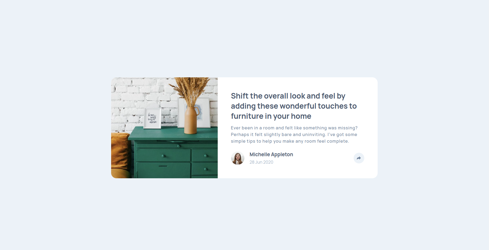
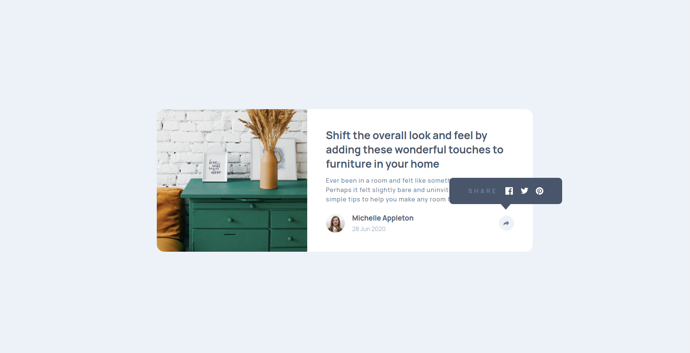
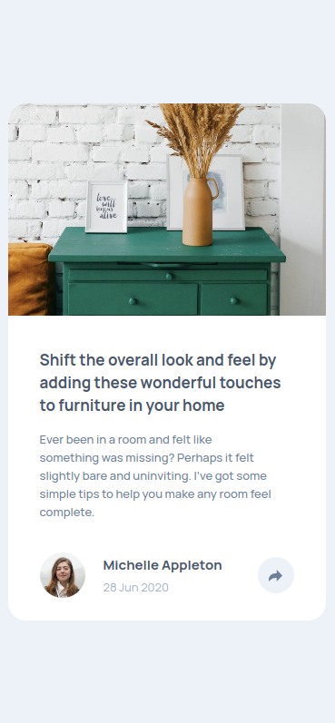
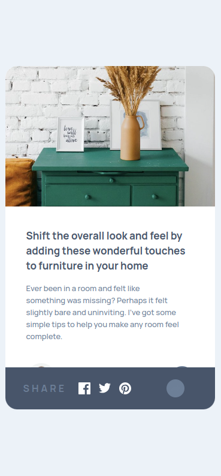

# Frontend Mentor - Article preview component solution

This is a solution to the [Article preview component challenge on Frontend Mentor](https://www.frontendmentor.io/challenges/article-preview-component-dYBN_pYFT). Frontend Mentor challenges help you improve your coding skills by building realistic projects. 

## Table of contents

- [Overview](#overview)
  - [Screenshot](#screenshot)
  - [Links](#links)
- [My process](#my-process)
  - [Built with](#built-with)
  - [Useful resources](#useful-resources)
- [Author](#author)

## Overview

### Screenshot

### Links

- Solution URL: [Solution URL](https://www.frontendmentor.io/solutions/article-preview-component-hFrvq7Y59L)
- Live Site URL: [Live site URL](https://alejandrvilla.github.io/Frontend_Mentor/article-preview-component-master/)

## My process

### Built with

- Semantic HTML5 markup
- CSS custom properties
- Flexbox
- CSS Grid
- Mobile-first workflow
- JS

### Useful resources

- [Guide to Flexbox](https://css-tricks.com/snippets/css/a-guide-to-flexbox/) - Useful to learn about Flexbox.
- [Guide to CSS Grid](https://css-tricks.com/snippets/css/complete-guide-grid/) - Useful to learn about CSS Grid
- [HTML DOM](https://www.w3schools.com/jsref/prop_html_innerhtml.asp)

## Author

- Website - [Alejandro Villa Herrera](https://www.linkedin.com/feed/)
- Frontend Mentor - [@AlejandrVilla](https://www.frontendmentor.io/profile/AlejandrVilla)
- Github - [@AlejandrVilla](https://github.com/AlejandrVilla)